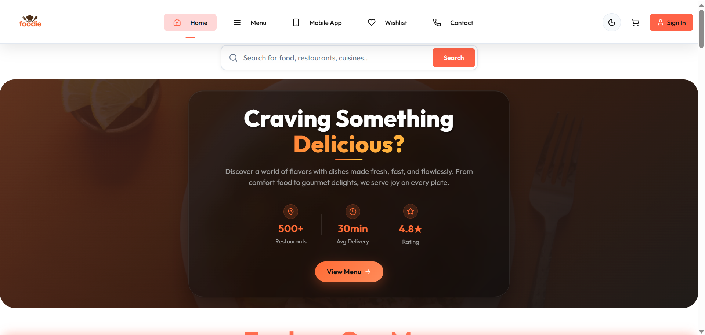

<div align="left">

# 🍽️ **Foodie – Full-Stack Restaurant App**

A full-stack web application for browsing, listing, and managing a variety of food items.  
Built with **React (Frontend)**, **Express.js (Backend)**, and **MongoDB**.

[](./LICENSE)
[](#-contributing)
[](https://gssoc.girlscript.tech/)
[](#-docker-setup-recommended)
[](https://github.com/Abhishek2634/Foodie)

---


<sup>Homepage – Light Mode</sup>

</div>

---

## 🌟 GSSoC


🌟 **Exciting News!**

🚀 This project is now officially part of **GirlScript Summer of Code – GSSoC’25!** 💻  
We’re thrilled to welcome contributors from across India and beyond to collaborate, build, and grow *Foodie!*  

GSSoC is one of India’s **largest open-source programs**, empowering developers of all levels to contribute to real-world projects and grow together.

🌈 With **mentorship**, **community support**, and **collaborative coding**, it’s the perfect platform to:

- ✨ Improve your development skills  
- 🤝 Contribute to impactful projects  
- 🏆 Get recognized for your work  
- 📜 Receive certificates and cool swag  

🎉 **Welcome, GSSoC’25 Contributors!** Let’s build, learn, and grow — one commit at a time.

---

## 🚀 Quick Navigation

> **📚 New to Foodie? Start Here:**  
> 👉 **[LEARN.md](./LEARN.md)** – Architecture, setup, and contribution guide.

> **⚡ Ready to dive in?**  
> Jump to [Getting Started](#-getting-started) for quick setup instructions.

---

## 📑 Table of Contents

- [🔧 Tech Stack](#-tech-stack)
  - [🖥️ Frontend](#️-frontend)
  - [🌐 Backend](#-backend)
  - [🗄️ Database](#️-database)
- [🚀 Getting Started](#-getting-started)
  - [Prerequisites](#prerequisites)
  - [📦 Installation](#-installation)
  - [🐳 Docker Setup (Recommended)](#-docker-setup-recommended)
  - [📦 Manual Installation](#-manual-installation)
  - [🔧 Development Setup](#-development-setup)
- [📁 Project Structure](#-project-structure)
- [🐳 Docker Commands](#-docker-commands)
- [🧪 Linting](#-linting)
- [🧰 Scripts](#-scripts)
- [📝 Notes](#-notes)
- [🧩 Common Issues & Fixes](#-common-issues--fixes)
- [🤝 Contributing](#-contributing)
- [📄 License](#-license)
- [🔗 References](#-references)

---

## 🔧 Tech Stack

### 🖥️ Frontend
- **React 18.3** – User interface  
- **Vite** – Lightning-fast build tool  
- **React Router DOM** – Client-side routing  
- **ESLint** – Code style enforcement  

### 🌐 Backend
- **Node.js + Express** – REST API server  
- **CORS + JSON Middleware** – Cross-origin handling  
- **Multer** – File upload management  
- **Modular Routing** – Organized API structure  

### 🗄️ Database
- **MongoDB** – NoSQL database for scalable storage  

### 🐳 DevOps
- **Docker** – Containerization  
- **Docker Compose** – Multi-service orchestration  

---

## 🚀 Getting Started

### Prerequisites

Ensure you have the following installed:

**For Docker Setup (Recommended):**

- Docker Desktop
- Docker Compose

**For Manual Setup:**

- Node.js (v16 or above)
- npm or yarn
- MongoDB (local or cloud)

---
### 📦 Installation

#### 🐳 Docker Setup (Recommended)

**One-command setup for the entire application:**

```bash
# Clone the repository
git clone https://github.com/your-username/foodie.git
cd foodie
npm install

# Start all services with Docker
docker-compose up --build
```

**Access the application:**

- 🌐 **Frontend**: [http://localhost:3000](http://localhost:3000)
- 🛠️ **Admin Panel**: [http://localhost:5173](http://localhost:5173)
- 🔌 **Backend API**: [http://localhost:4000](http://localhost:4000)
- 🗄️ **MongoDB**: localhost:27017

**Docker Services:**

* **foodie-frontend**: React app (Port 3000)
* **foodie-admin**: Admin panel (Port 5173)
* **foodie-backend**: Express API (Port 4000)
* **foodie-mongodb**: MongoDB database (Port 27017)
---
#### 📦 Manual Installation

```bash
# Clone the repository
git clone https://github.com/your-username/foodie.git
cd foodie

# Install dependencies for all services
cd frontend && npm install && cd ..
cd backend && npm install && cd ..
cd admin && npm install && cd ..
```
---
### 🔧 Development Setup

#### Docker Development

```bash
# Start all services
docker-compose up

# Start in detached mode
docker-compose up -d

# View logs for specific service
docker-compose logs frontend
docker-compose logs backend
docker-compose logs admin
```

#### Manual Development

**Start Frontend:**

```bash
cd frontend
npm run dev
```

**Start Admin Panel:**

**Start Frontend (Customer & Admin):**

```bash
cd frontend
npm run dev
```

Frontend runs on `http://localhost:5173` (Customer Storefront at `/`, Admin Dashboard at `/admin`).

**Start Backend:**

```bash
cd backend
npm start
```

Server runs on `http://localhost:4000`

**Start MongoDB:**

```bash
# Make sure MongoDB is running locally
mongod
```
---
## 📁 Project Structure

```
Foodie/                       # Root folder of the project
├── .github/                   # GitHub related configurations
├── backend/                   # Express + MongoDB API
│   ├── controllers/           # API request controllers
│   ├── models/                # Mongoose data models
│   ├── routes/                # Route definitions
│   ├── middlewares/           # Authentication & RBAC middlewares
│   └── server.js              # Server entry point
├── frontend/                  # Integrated React + Vite application
│   ├── src/
│   │   ├── admin/             # Role-based Admin Dashboard module
│   │   ├── components/        # Customer UI components
│   │   ├── pages/             # Customer pages
│   │   ├── context/           # Global application contexts
│   │   ├── lib/               # Shared API client (apiRequest.js)
│   │   └── App.jsx            # Main app router with role guards
├── images/                    # Project screenshots & assets
├── docker-compose.yml         # Unified Docker Compose configuration
├── README.md                  # Project documentation
└── package.json               # NPM configuration
```
---
## 🐳 Docker Commands

### Basic Operations

```bash
# Build and start all services
docker-compose up --build

# Start services in background
docker-compose up -d

# Stop all services
docker-compose down

# Stop and remove volumes (⚠️ deletes database data)
docker-compose down -v

# Restart specific service
docker-compose restart backend

# View running containers
docker-compose ps
```

### Development Commands

```bash
# View logs for all services
docker-compose logs

# View logs for specific service
docker-compose logs -f frontend

# Execute commands in running container
docker-compose exec backend npm install new-package

# Rebuild specific service
docker-compose build backend
```

### Database Management

```bash
# Access MongoDB shell
docker-compose exec mongodb mongosh

# Backup database
docker-compose exec mongodb mongodump --out /backup

# View MongoDB logs
docker-compose logs mongodb
```
---

## 🧪 Linting

ESLint is pre-configured with React and Hooks rules for frontend and admin.

```bash
# Frontend linting
cd frontend && npm run lint

# Admin linting
cd admin && npm run lint
```
---
## 🧰 Scripts

### Frontend & Admin Scripts

| Command           | Description                   |
| ----------------- | ----------------------------- |
| `npm run dev`     | Start Vite development server |
| `npm run build`   | Build for production          |
| `npm run preview` | Preview production build      |
| `npm run lint`    | Run ESLint checks             |

### Backend Scripts

| Command          | Description                           |
| ---------------- | ------------------------------------- |
| `npm start`      | Start production server               |
| `npm run server` | Start development server with nodemon |
---

## 📝 Notes

- Make sure MongoDB is running locally or update `connectDB()` in `config/db.js` accordingly.
- You can update the backend routes via `routes/foodRoute.js`.

### Environment Variables

The application uses the following environment variables:

**Backend:**

- `MONGODB_URI`: MongoDB connection string
- `JWT_SECRET`: Secret key for JWT tokens
- `PORT`: Server port (default: 4000)

**Frontend:**

- `REACT_APP_API_URL`: Backend API URL

**Admin:**

- `VITE_API_URL`: Backend API URL for Vite

### Database Configuration

- **Docker**: MongoDB runs automatically with authentication
  - Username: `admin`
  - Password: `password123`
  - Database: `foodie`
- **Manual**: Update `connectDB()` in `backend/config/db.js`

### File Uploads

* Backend handles file uploads via Multer
* Files are stored in `backend/uploads/` directory
* Docker setup includes volume mounting for persistence
---

## 🤝 Contributing

We welcome contributions to the Foodie project! If you find this project helpful, consider starring the repo or opening an issue.

- 📖 Help improve documentation
- 🚀 For more info, go to [CONTRIBUTING.md](CONTRIBUTING.md)

### Development Workflow
1. Fork the repository
2. Create a feature branch
3. Use Docker for consistent development environment
4. Test your changes with `docker-compose up --build`
5. Submit a pull request

---

## Contributor

A heartfelt thank you to all the contributors who have dedicated their time and effort to make this project a success.  
Your contributions—whether it’s code, design, testing, or documentation—are truly appreciated! 🚀

#### Thanks to all the wonderful contributors 💖

<a href="https://github.com/Abhishek2634/Foodie/graphs/contributors">
  
</a>

#### See full list of contribution from contributor [Contributor Graph](https://github.com/Abhishek2634/Foodie/graphs/contributors)

---

## 📄 License
This project is licensed under the [MIT License](./LICENSE)

- [LinkedIn](https://www.linkedin.com/in/abhishekfarswal/?originalSubdomain=in)  
- [Twitter](https://x.com/Abhishek899620)  
- [Instagram](https://www.instagram.com/abhishekfarswal/)
  
---
## Contact 📝
If you have any questions, feedback, or want to collaborate, feel free to reach out to the project maintainer:

**Maintainer:** Abhishek Farshwal
**GitHub:** [Foodie](https://github.com/Abhishek2634)  

- [LinkedIn](https://www.linkedin.com/in/abhishekfarswal/?originalSubdomain=in)  
- [Twitter](https://x.com/Abhishek899620)  
- [Instagram](https://www.instagram.com/abhishekfarswal/)

---
## 🔗 References
* [React](https://reactjs.org/)
* [Vite](https://vitejs.dev/)
* [Express](https://expressjs.com/)
* [MongoDB](https://www.mongodb.com/)
* [Docker](https://www.docker.com/)
